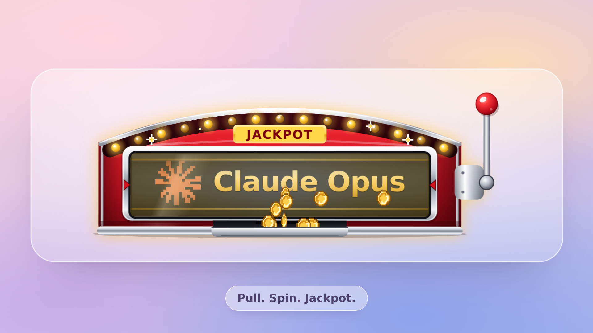

# Model Slot

A model picker that **is** a miniature casino slot machine. It has a red-enamel cabinet, a chrome arch with light bulbs, a glass reel window that shows the model's logo and name, a side lever with a glossy red ball, and a coin tray.



▶ [Showcase video](./media/showcase.mp4)

Swipe the reel to switch models. Pull the lever (or flick hard) to spin: the bulbs chase, the drum blurs, and it lands on a random model. Land on **Claude Opus** and you hit the gold jackpot: the cabinet shakes, the bulbs strobe gold and pixel coins pour into the tray. **GPT-6 Astra** gets its own win, with blue-white starlight and silver star-coins.

Models: **DeepSeek · Claude Sonnet · Claude Opus · GPT-6 Sol · GPT-6 Astra**. The logos are hand-drawn pixel versions of each brand's mark: DeepSeek's blue whale, Claude's terracotta spark and OpenAI's blossom.

Category: ui-component

## Sizes

- **Default (compact)** is 120 × 36 px and sits in a chat composer's bottom row. It has 9 bulbs that only chase on hover or focus, short labels (Sonnet, Opus, Sol, Astra) next to the brand mark, and a thin tray lip that pops out on a jackpot.
- **`size="lg"`** is the full showcase drawing at 459 × 144 px, with 15 chasing bulbs, a JACKPOT plate and full model names.

## Install

Copy `ModelSlotCabinet.jsx` and `model-slot-cabinet.css` into your project and import the CSS once. React 18+ is the only dependency, and it is SSR-safe.

```jsx
import ModelSlotCabinet from './ModelSlotCabinet.jsx';
import './model-slot-cabinet.css';

<ModelSlotCabinet defaultValue="claude-sonnet" onChange={(id, model, { reason }) => {}} />
<ModelSlotCabinet size="lg" value={v} onChange={setV} sound />
```

Imperative: `ref.current.spin({ to: 'claude-opus' })`, `ref.current.step(1)`.

## Plain HTML (no React)

`model-slot.js` is a Web Component with everything inside it. Add the script and use the tag:

```html
<script src="model-slot.js"></script>

<model-slot></model-slot>
<model-slot size="lg" value="claude-opus" sound></model-slot>
```

Attributes match the props (`models` as JSON or `el.models = [...]`). The `change` event carries `detail.value`, `detail.model` and `detail.reason`. `el.value` reads the current model, and `el.spin()` and `el.step(n)` work on the element. See `example.html`.

## Props

| Prop | Default | |
|---|---|---|
| `models` | 5 built-in | `{ id, name, short, logo, jackpot: 'gold' \| 'star' }[]` |
| `value` / `defaultValue` | | controlled / uncontrolled model id |
| `onChange(id, model, { reason })` | | `reason` is `step` or `spin` |
| `size` | `'sm'` | `'sm'` (composer) or `'lg'` (showcase) |
| `sound` | `false` | tiny WebAudio ticks, ding, clunk and coins |
| `lever` | `true` | show the side lever |
| `label`, `disabled`, `rng`, `className`, `style`, `id` | | |

## Interaction

- Swipe, scroll wheel, ↑ / ↓ or a tap on the window steps one model, with motion blur, a spring overshoot and a ding.
- Drag the lever down (the ball comes toward you) and it clunks and spins. Tapping the lever, pressing Enter or Space, or flicking hard also spins.
- A spin decelerates onto a random different model. Opus and Astra hit a jackpot after a spin; other models get a ding and a bulb blink.
- Accessibility: `role="spinbutton"` with the full model name in `aria-valuetext`, and spin results go to a polite live region.
- `prefers-reduced-motion`: instant swap, static bulbs, no effects.

## Files

- `ModelSlotCabinet.jsx`: the component (cabinet in inline SVG, reel in HTML, one rAF spring loop)
- `model-slot-cabinet.css`
- `model-slot.js`: the same component as a plain-HTML Web Component (`<model-slot>`), no React needed
- `example.html`: the Web Component on a plain page
- `demo.html`: offline demo. Use `?mode=hero` for the large size and `?mode=chips` for all five models in composers
- `media/`: showcase video and poster

## License

Free for non-commercial use ([PolyForm Noncommercial 1.0.0](../LICENSE)). Commercial use needs permission, see [COMMERCIAL.md](../COMMERCIAL.md).
