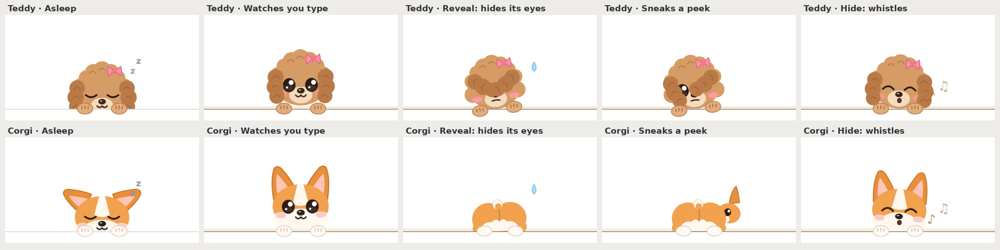

# Nosy Password

A password field with a nosy little animal peeking over the top edge. Pick `animal="teddy"` (a toy poodle with a pink bow) or `animal="corgi"`.

- **Asleep** until you tap the field, then startles awake.
- **Eyes follow your typing**, and leans in closer the faster you type.
- **Reveal the password** and it gasps and hides its eyes in its own way: the teddy flips its big curly ears over them, the corgi spins round and shows you its butt. A second later it sneaks a peek and gets caught.
- **Hide it again** and it whistles like nothing happened.
- **Clear the field** and it sinks back, disappointed.



Open `demo.html` (works offline), pick an animal and press ▶ Autoplay, or type a dummy password yourself.

## React

```jsx
import NosyPassword from './NosyPassword.jsx';
import './nosy-password.css';

<NosyPassword label="Password" onChange={(v) => setPw(v)} />
<NosyPassword animal="corgi" size="lg" />
```

Props: `animal` (`"teddy"` or `"corgi"`), `value` / `defaultValue` / `onChange(value, event)`, `revealed` / `defaultRevealed` / `onRevealChange(bool)`, `label`, `placeholder`, `name`, `id`, `autoComplete`, `disabled`, `size` (`"md"` or `"lg"`), `inputProps`. Ref: `focus()`, `blur()`, `reveal(bool)`, `input`.

## Plain HTML

```html
<script src="nosy-password.js"></script>
<nosy-password animal="corgi" label="Password"></nosy-password>
```

Events: `input` (`detail.value`), `reveal` (`detail.revealed`). See `example.html`.

It's a real `<input type="password">` with a labelled show/hide button (`aria-pressed`), so password managers, keyboard and screen readers work as usual. The animal is decorative and hidden from assistive tech. `prefers-reduced-motion` keeps the poses but drops the motion.

## License

Free for non-commercial use under the [PolyForm Noncommercial License 1.0.0](../LICENSE). Commercial use needs permission, see [COMMERCIAL.md](../COMMERCIAL.md).
