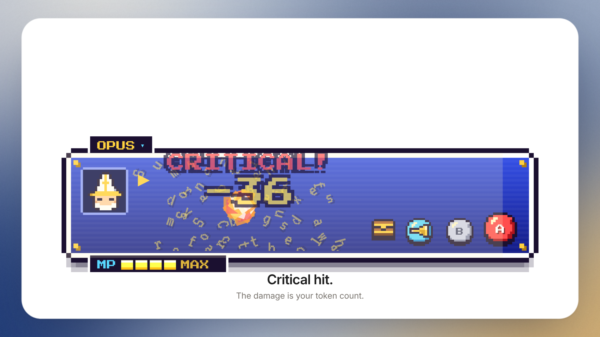

# Pixel Dialog

A chat input for AI agents that **is** a 16-bit RPG dialogue box. A little mage reads what you type, casts your message as a spell when you press A, listens when you talk, and drops a treasure chest when you attach a file. Pick the model by swapping party members, and set thinking effort on an MP bar.



▶ [Showcase video](./media/showcase.mp4)

Every message is a spell, and its size decides which one. Short messages cast **FIRE**, longer ones **FIRA**, and long prompts cast **FIRAGA**: the box turns into a night sky, a meteor crashes into your words and a **CRITICAL!** shows the damage, which is your message's token count. The tag on the top border shows the spell and the token cost while you type.

Category: ui-component

## What it does

- **Spells by length.** FIRE, FIRA, FIRAGA, picked from an estimated token count (CJK counts per character, other text about 4 characters per token). Tune it with `spellTiers`.
- **The mage reacts to what you write.** A `?` puzzles him, a `!` makes him jump, "please" or "thanks" gets hearts, and code puts on his glasses.
- **Models are party members.** Click the name plate and a PARTY menu opens. Each model is its own class with its own hat: OPUS the Sage, SONNET the Mage, GPT the Knight and DEEPSEEK the Ninja. Pick one and they jump into the portrait with "OPUS joined the party!". Bring your own list with `models`.
- **Thinking effort is MP.** The MP bar on the bottom border has LOW, MED, HIGH and MAX. Click a pip or use the arrow keys. Every message spends MP, and higher effort charges the spell longer. At LOW the hero dozes off with a Zz when the box is idle. At MAX the bar turns gold and the portrait gets a limit-break aura.
- **Voice input.** Tap the blue horn button. The mage holds a brass ear trumpet, notes float along the border from a LISTEN meter into his name plate, and your words type themselves in as you speak (Web Speech API). Browsers without speech recognition get "You have not learned this spell yet."
- **Loot by rarity.** Attach with the chest button, drag and drop, or paste. Images drop a rare chest, documents an epic one and archives a legendary one, each with its own light pillar and colour.
- **Classic RPG lines.** Send an empty box and you get "But nothing happened..." with a puff of smoke. Clear with B or Esc and it's "Got away safely!"
- **ENEMY TURN.** While `busy`, the mage raises a shield, the A button becomes an hourglass and the tag reads ENEMY TURN.
- **A secret.** Type ↑↑↓↓←→←→BA in the box for gold mode and ULTIMA.

## Sizes

- **Default** is compact and sits in a chat composer.
- **`size="lg"`** is the big showcase version.

## Install

Copy `PixelDialog.jsx`, `pixel-dialog.css` and the `fonts/` folder into your project and import the CSS once. React 18+ is the only dependency, and it is SSR-safe.

```jsx
import PixelDialog from './PixelDialog.jsx';
import './pixel-dialog.css';

<PixelDialog onSend={(text, files) => {}} busy={thinking} />
<PixelDialog size="lg" sound defaultModel="claude-opus" defaultEffort="max" />
<PixelDialog models={myModels} onModelChange={(id) => {}} onEffortChange={(id) => {}} />
```

Imperative: `ref.current.send()`, `clear()`, `focus()`, `attach(files)`, `listen()`, `stopListening()`, `konami()`, `setModel(id)`, `setEffort(id)`, `openParty()`, and `simulateVoice(text, ms)` for demos and recordings.

## Plain HTML (no React)

`pixel-dialog.js` is a Web Component with everything inside it. Add the script and use the tag:

```html
<script src="pixel-dialog.js"></script>

<pixel-dialog effort="high"></pixel-dialog>
<pixel-dialog size="lg" model="claude-opus" sound></pixel-dialog>
```

Attributes match the props in kebab-case (`max-rows`, `spell-tiers`). Lists go in as JSON (`models='[{"id":"a","name":"ALPHA","job":"knight"}]'`) or as a property (`el.models = [...]`). Events: `send` (`detail.text`, `detail.files`), `input`, `modelchange`, `effortchange`, `attach`, `clear`, `listen`. `el.value`, `el.model` and `el.effort` read the current state, and the methods above work on the element (`el.send()`). The pixel fonts are built into the file. See `example.html`.

## Props

| Prop | Default | |
|---|---|---|
| `value` / `defaultValue` | `''` | controlled / uncontrolled text |
| `onChange(text)`, `onSend(text, files)`, `onClear()`, `onAttach(files)` | | |
| `models` | OPUS, SONNET, GPT, DEEPSEEK | `[{ id, name, job }]`, job is `'mage'`, `'sage'`, `'knight'` or `'ninja'`. `false` hides the party menu |
| `model` / `defaultModel`, `onModelChange(id, model)` | `'claude-sonnet'` | the selected model |
| `efforts` | LOW, MED, HIGH, MAX | `[{ id, label }]`. `false` hides the MP bar |
| `effort` / `defaultEffort`, `onEffortChange(id, effort)` | `'medium'` | thinking effort |
| `busy` | `false` | the agent's turn: shield, hourglass, ENEMY TURN |
| `size` | `'md'` | `'md'` (composer) or `'lg'` (showcase) |
| `spellTiers` | `[12, 60]` | token limits for FIRE and FIRA; above the second is FIRAGA |
| `voice` | `true` | show the horn (voice) button |
| `lang`, `onListen(on)` | | speech recognition language, listening callback |
| `sound` | `false` | tiny 8-bit WebAudio bleeps |
| `name` | `'AGENT'` | the name plate when `models` is `false` |
| `placeholder` | `'PRESS START'` | |
| `accept`, `maxRows`, `disabled`, `ariaLabel`, `className` | | |

## Interaction

- Enter or A sends, Shift+Enter adds a line, Esc or B clears.
- Accessibility: a real labelled textarea, labelled buttons (the horn is a toggle with `aria-pressed`), the name plate opens a listbox you can drive with the arrow keys, and the MP bar is a slider, and sends, items and listening go to a polite live region.
- `prefers-reduced-motion`: no fireballs, meteors, chests or notes, just the result.

## Files

- `PixelDialog.jsx`: the component (pixel sprites drawn as inline SVG)
- `pixel-dialog.css`
- `pixel-dialog.js`: the same component as a plain-HTML Web Component (`<pixel-dialog>`), no React needed
- `example.html`: the Web Component on a plain page
- `fonts/`: Press Start 2P and VT323 (SIL Open Font License, see `fonts/FONTS.md`)
- `demo.html`: offline demo. Use `?mode=hero` for the large size
- `media/`: showcase video and poster

## License

Free for non-commercial use ([PolyForm Noncommercial 1.0.0](../LICENSE)). Commercial use needs permission, see [COMMERCIAL.md](../COMMERCIAL.md). The bundled fonts keep their own SIL Open Font License.
