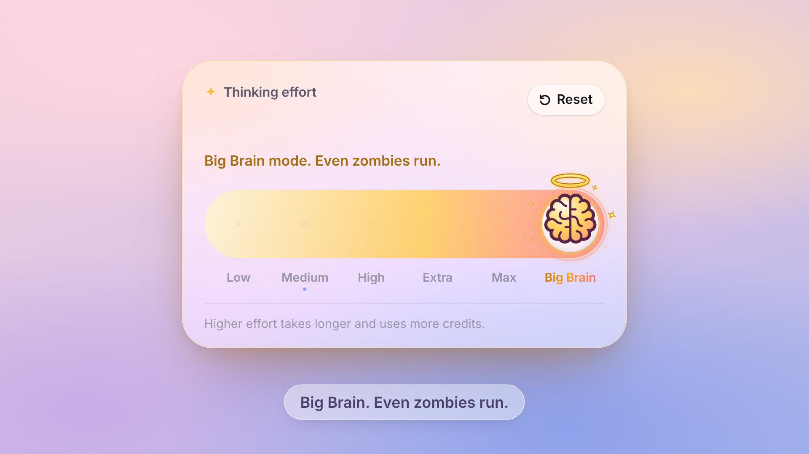

# Effort Glass

A frosted-glass **thinking-effort slider** where the brain illustration itself is the knob, and a zombie lives in the track.

The rule is simple: **the busier the brain, the less the zombie dares to come close.** At Low the brain is sound asleep under a night sky: it wears a striped nightcap, floats *zzz* and blows a snot bubble that swells the closer the zombie shuffles. Pull past Low and the bubble pops, the brain startles awake (eyes wide, cap knocked askew) and a split second later the zombie bites: the label turns **Brainless**. Slide right and the brain grows back. Push the effort up and the zombie backs away, sweating and shivering, until it only peeks in from the edge at Max. Go one more to **Big Brain**: the disc and brain grow together (×1.14, still inside the track), the disc gets a polished gold rim, the brain turns gold with a rim-light and a shine sweeping across it, soft golden rays turn slowly behind it, sparkles twinkle and a crisp halo floats above, and the zombie throws its hands on its head, screams "AAA!" and runs off the track.

While you leave it at Medium, High or Extra, the zombie gets ideas: every few seconds it tiptoes toward the brain, the brain flashes a "!", and the zombie jumps and scoots back, sweating.



▶ [Showcase video](./media/showcase.mp4)

Levels: **Low · Medium · High · Extra · Max · Big Brain**

## Level looks

Each level has its own look, not just a colour. The knob, the track fill, the card accent and the label/hint treatment all change, and every one of them blends smoothly as the knob moves.

| Level | Brain knob | Track fill | Card / text |
|---|---|---|---|
| **Low** · sound asleep | Dusty brain with a drooping tilt, a soft blue striped nightcap with a pom-pom, a snot bubble that inflates and deflates with the slow breath, floating *zzz* | Dark-blue night sky with a small crescent moon and a few faint stars (the detent dots become stars) | Night-blue accent, indigo label, italic hint |
| **Medium** · awake | Soft pink, gentle breathing, soft glow | White glass with a pink tint | Pink accent, ink label |
| **High** · focused | Brighter, twinkling spark stars and neuron flickers around it | Violet-magenta with a faint neuron dot grid | Violet accent, violet gradient label |
| **Extra** · intense | Fast pulse, flickering electric arcs | Warm coral with moving electric stripes | Orange accent, orange-pink gradient label |
| **Max** · overclocked | Red-hot brain, steam puffs, heat waves, slight shake | Red-hot gradient with a heat shimmer | Red accent, bold hint |
| **Big Brain** | Disc + brain grow ×1.14 and float, gold disc rim, golden brain with rim-light and a sweeping shine, slowly turning light rays, twinkling sparkles, crisp halo | Polished gold with a bright sheen sweeping across | Gold accent, shimmering gold label |

Same visual language as [views-bar](../views-bar) and [profile-settings](../profile-settings). The original dark version is [effort-brain](../effort-brain).

Category: ui-component

## Install

Copy `EffortGlass.jsx` and `effort-glass.css` into your project and import the CSS once. The only dependency is React 18+. Works in Next.js (App Router and Pages), Vite, Remix and CRA.

```jsx
import EffortGlass from './effort-glass/EffortGlass';
import './effort-glass/effort-glass.css';

export default function ModelSettings() {
  return (
    <EffortGlass
      defaultValue={1}
      onChange={(index, level) => console.log(index, level.name)}
      onBrainless={() => console.log('🧟 brain eaten')}
    />
  );
}
```

Controlled:

```jsx
const [effort, setEffort] = useState(2);
<EffortGlass value={effort} onChange={setEffort} />
```

Glass needs something behind it, so put it over a gradient or an image (the demo uses a soft sunset gradient).

## Plain HTML (no React)

`thinking-effort.js` is a Web Component with everything inside it. Add the script and use the tag:

```html
<script src="thinking-effort.js"></script>

<thinking-effort value="1"></thinking-effort>
```

Attributes match the props in kebab-case (`easter-eggs`, `levels` and `voices` as JSON, `sound`, `voice-base`, `volume`). `<thinking-effort sound>` turns the voice on. The `change` event carries `detail.value` (the level index) and `detail.level`, and `brainless` fires when the zombie eats the brain. `el.value` reads the current level. See `example.html`.

## Props

| Prop | Type | Default | Description |
|---|---|---|---|
| `levels` | `{ name, hint }[]` | 6 levels | Low → highest. Any count works: levels are mapped onto the six looks, and the last level is always the Big Brain look. |
| `value` | number | – | Controlled index. |
| `defaultValue` | number | `1` | Initial index when uncontrolled. |
| `recommended` | number | `1` | Gets the ring tick, the dot under its label and the "Recommended" chip. **Reset** returns here. |
| `title` | string | `'Thinking effort'` | Eyebrow title, also the slider's `aria-label`. |
| `footnote` | string | `'Higher effort takes longer and uses more credits.'` | Footer text. Pass `''` to hide it. |
| `zombie` | boolean | `true` | Turn the zombie off. Over-pull then just rubber-bands, and `←` at Low gives the knob a small bump. |
| `easterEggs` | boolean | `true` | The zombie's sneak-up gag at Medium, High and Extra. Always off with `prefers-reduced-motion`. (The Low nap, bubble and pop are part of the Low look, not an easter egg.) |
| `sound` | boolean | `false` | The zombie's voice: Crazy-Dave-style gibberish (see [Voice](#voice)). Off by default. Nothing is created or downloaded until it is on, and nothing plays before the user touches the slider. |
| `voices` | `{ [look]: (string \| { src, text, syl })[], eat?: …, tick?: string }` | built-in set | Replace any of the lines (a URL keeps the built-in words and timing for that slot; an object brings its own). Keys `0`–`5` are the six looks (Low … Big Brain; the same as the level index with the default 6 levels), `eat` is the over-pull bite, `tick` an optional short sound on each step while dragging (off by default; pass `tick: "tick.mp3"` to turn it on). Relative URLs are resolved against `voiceBase`; absolute, `/…`, `data:` and `blob:` URLs are used as is. |
| `voiceBase` | string | `'media/voice/'` | Where the built-in files live, relative to the page. With a bundler, copy `media/voice/` into your public folder and point this at it (e.g. `'/effort-voice/'`). |
| `volume` | number | `0.8` | Voice volume, 0–1. |
| `onChange` | `(index, level) => void` | – | Fired when a new level is committed: on release, a tap, a key press, a label click, or Reset. |
| `onBrainless` | `() => void` | – | Fired when the zombie bites the brain. |
| `className` | string | `''` | Extra class names on the root. |

Named exports: `DEFAULT_LEVELS`, `looks(u)` (the look values for a position `u` in 0..5), `bubbleSize(gap)` (the snot-bubble scale for an effective zombie gap in px), plus `BrainArt`, `ZombieArt` and `KnobFX` (the character and effect SVGs; pass `still={{…}}` to render a fixed pose, for example in static previews; `BrainArt` takes `cap`, `askew`, `eyes`, `bub` and `pop` for the Low look).

## Interaction

- **Drag** follows your finger 1:1. Where you grab the knob is kept (the grab offset), so the knob never jumps under your finger.
- **Rubber band** past both ends, using the iOS formula `(1 − 1/(x·0.55/d + 1))·d`.
- **Release** snaps with a spring to the level nearest the velocity-projected position. A flick carries up to two levels, and the spring starts with your hand's speed.
- **Tap** the track to glide to the nearest level. Press and drag on the track, and the knob catches up to your finger, then tracks it 1:1.
- **Detents**: the knob gives a tiny scale pulse each time it crosses a level while dragging, and the big level name rolls like an odometer.
- **Keyboard**: the track is a focusable ARIA `slider`. `←` `→` `↑` `↓` `PageUp` `PageDown` step, and `Home` / `End` jump. `←` at Low feeds the brain to the zombie.
- Tap a level name to jump to it. **Reset** appears when you are off the recommended level or brainless.

## Character logic

Every character value is a smooth function of the knob's *live* position (in level units, including rubber-band over-pull), so nothing jumps from one level to the next:

| Value | Function of the live position |
|---|---|
| Level looks | Six triangular weights (`--eg-l0` … `--eg-l5`, always summing to 1) cross-fade the fills and breathing styles. The accent and hint colours are blended from per-level palettes. Sparks, arcs, heat and Big Brain each fade in on their own smooth curve. |
| Zombie x | Monotone cubic through a stand-off curve (close at Low, backing off through Medium and High, peeking from the edge at Max, off the track at Big Brain), never closer than the knob's edge, and leaning in during over-pull. It follows that target on its own softer spring, so it lags and settles organically. |
| Nerves | Rise from Medium to High and stay through Max: sweat drop, shrinking pupils, a shiver, leaning away. |
| Scream | Starts as soon as the knob leaves Max: arms up, hands on head, open-mouth scream, "AAA!" bubble, tiny pupils, flying sweat. The zombie's spring gets faster, and a frantic run cycle plus speed lines kick in while it is moving. |
| Sleep (Low) | The nightcap, *zzz* and snot bubble follow `--eg-sleep`, and the night sky follows the Low look weight `--eg-l0`, so all of it blends out continuously as the knob leaves Low: the cap fades and lifts off, the bubble shrinks away, the sky cross-fades to the next level's track. |
| Snot bubble | Its size is `bubbleSize(gap)`: 0.45 far away → 1.45 nose to nose, where `gap` is the zombie's *live spring* position minus the knob centre, minus up to 40 px of over-pull lean-in. So the closer the zombie gets, including while it leans in as you over-pull, the bigger the bubble. On top of that it inflates and deflates on the same 4.6 s loop as the slow Low breath. Hidden while brainless; it blows up again the next time the brain dozes off at Low. |
| Bite | Over-pull past about 0.36 of a level (or `←` at Low) starts the sequence: the **bubble pops** (burst ring, spikes, flying droplets), ~70 ms later the **brain startles awake** (eyes snap open, the knob jolts, a "!" flashes, the cap is knocked askew), and ~150 ms after that the **zombie lunges** above the knob and takes **one big chomp out of the right half** (the side facing it) of the disc and the brain together: a clean edge of four big tooth scallops running top to bottom. The brain's dark outline (with a pink flesh edge just inside) and the disc's rim are redrawn along the cut, so the bite looks drawn rather than masked, and the track shows through it. The nightcap is knocked clean off: it flies up and away, spinning, and fades. Crumbs (brain bits and porcelain chips) fly from the cut edge toward the zombie. The half brain that is left stares with dazed spiral eyes while dizzy stars circle it. The zombie then **chews twice** (jaw + head bob), lets out a small **"burp"** puff, and goes back to idling (root `data-munch="chew" | "burp"`). The bite shrinks continuously as you slide right and is fully regrown by about 0.9. The root carries `data-nap="pop" | "startle" | "bite"` during the sequence. |

### Voice

With `sound` on, the zombie talks in Crazy-Dave-style gibberish, recorded by [@nextoneforeal](https://x.com/nextoneforeal). The speech bubble shows the words he actually says and **types them syllable by syllable in time with the audio**:

| Look | Lines (what he says) |
|---|---|
| Low · sleepy (a soft, silent *zzz* trails each line) | *deh-eh pfeza… tamit-mand… zzz* · *bladi-gadi… zzz* |
| Medium · curious | **Wabi-babu!** (歪比巴卜, the signature line) · *Bladni-vavi?* |
| High · on it | *Omai vabo, bada-bada!* · *Wabi-babu!!* |
| Extra · shout | *CHA-LONG-NAO!!* · *Belkam-fila lode-BLALAK!* |
| Max · fast chatter | *nödeeb-vitha-demut-ferverb-tap!* · *bedude-dvedjeb-zibga-vavevol!* |
| Big Brain · screams as he runs (fades out) | *NE-FAAA-FUUU-EEET!* · *CHAAA-LE-NAOOO~!* |
| Bite (over-pull) · munching | *mlah-hama… awhamam~* |

- While you drag, each detent plays only a tiny syllable (the "ba" of *Wabi-babu*) whose pitch rises with the level. When the knob **settles** on a level (after ~140 ms of rest) the zombie says one full line. A new line always cuts off the previous one, and leaving a level cuts its line short.
- The first line a level says is its first take, so the first thing you usually hear is **Wabi-babu!** at Medium. After that the takes alternate, never the same one twice in a row.
- The Big Brain scream starts the moment the zombie bolts, so it stays in sync with the run-away, and it doesn't repeat when the knob lands. The bite line plays on the crunch, and there is no Low line while the brain is gone.
- Every line carries its syllable onsets (`VOICE_LINES` export: `{ src, text, syl: [{ t, s }] }`, `t` in seconds into the file; a syllable with `z: 1` is typed but not spoken, like Low's trailing *zzz*). The bubble starts typing the moment the audio starts, and **types at the same pace when muted**. The full line reserves the bubble's width, so it never jumps while typing. With `voices` you can pass plain URLs (they keep the built-in words and timing for that slot) or your own `{ src, text, syl }` objects.
- Audio is Web Audio, created lazily: the context is unlocked on the first pointer or key press on the slider (autoplay rules), and the ~300 KB of MP3s are fetched only once `sound` is on.
- The bubble sits above the zombie's head, stays inside the card and never covers the knob: it slides to the knob's right, or lifts over it when there is no room. With `prefers-reduced-motion` it only fades (syllables still appear on time, without the pop).

The files in `media/voice/` are the creator's own raw takes, cut at natural pauses, with only a gentle 80 Hz high-pass, light noise reduction, short fades and loudness normalisation to −16 LUFS (true peak ≤ −1.5 dBTP). The two Max lines come from the cleanest take and skip noise reduction: just the high-pass, a gentle peak compressor and −17 LUFS, so the limiter never has to touch them. No pitch shift or effects. MP3 128 kb/s, 48 kHz mono.

### Easter egg

At Medium, High and Extra, while the slider is idle, a randomized timer fires every 4–8 s (×1.35 at High, ×1.8 at Extra). The zombie tiptoes in with sly half-closed eyes (a slow spring), the brain flashes and pops a "!", then the zombie jumps, gets a "!" of its own, scoots back past its spot and settles. Boldness drops with level: it covers 55% of the gap at Medium, 42% at High and 30% at Extra.

It never fights the spring engine. The gag is only an **offset added to the zombie's spring target** (plus a temporary spring response), so drag, flicks and level changes simply take over. A drag, a level change, Low, Max, Big Brain, Brainless, `zombie={false}`, `easterEggs={false}` or reduced motion cancel it and clear the timer. The root carries `data-egg="sneak" | "alert" | "scoot"` and `data-egg-armed="0|1"` if you want to style or test it.

## Implementation notes

- **One rAF loop** integrates every spring (knob, zombie x/y/rotation, press scale, bite) with sub-stepped damped springs (response + damping ratio). It writes `transform`s and CSS variables (level weights `--eg-l0…5`, `--eg-sleep`, `--eg-awake`, `--eg-spark`, `--eg-zap`, `--eg-hot`, `--eg-bb`, `--eg-glow`, `--eg-accent`, `--eg-hint`, the zombie's `--eg-fear`, `--eg-sweat`, `--eg-scream`, `--eg-flee`, `--eg-sneak`, `--eg-scare`, and the Low snot bubble's `--eg-bub`) straight to the DOM. There is no per-frame React render and no CSS `left` transition. The loop stops when everything settles; the easter-egg timer is a plain `setTimeout` that wakes it.
- React re-renders only when the nearest level, the brainless flag, or the eating phase changes.
- Ambient motion (zombie shuffle, shiver, tiptoe, run cycle, per-level breathing, sparks, arc flicker, steam, shake, float, halo, light rays, fill stripes and shimmer, snot-bubble breathing, star twinkle, pop burst) is CSS keyframes whose amplitude or opacity comes from those variables, so it costs no JS and blends with the knob.
- **SSR-safe**: `'use client'`, no `window` access during render, and the first paint is positioned with `calc()` from the value, with the level-look variables inlined for that value, so there is no layout or colour jump on hydration.
- **Scoped**: every class starts with `eg-`, and SVG ids come from `useId`, so several sliders can share a page.
- **`prefers-reduced-motion`**: springs snap, ambient animation stops, the random easter egg is disabled, and each level shows a still version of its look (at Low: cap, still bubble sized by the zombie's distance, moon). The pop → startle → bite sequence collapses into an instant half-eaten state (no burst, crumbs, cap flight or burp).
- The knob is a 56px porcelain disc (SVG): a soft shadow centred under it, a subtle top highlight, a hairline rim and a thin per-level accent ring concentric with it (night blue at Low … gold at Big Brain). The brain sits in a 44px box centred on it, ~6px clear of the rim at every level. The fill's rounded end is concentric with the disc, so it ends as a centred cap behind it. Keyboard focus draws a ring around the disc.
- The bite is four circles plus a rect in the brain's own SVG units: they mask the brain directly, and mask the disc through `discPose()` (the brain's sleep tilt mapped into disc pixels), so disc and brain are cut along one line. Breathing pauses while bitten so the two stay in register.

## Files

- `EffortGlass.jsx`: the component
- `effort-glass.css`: styles
- `thinking-effort.js`: the same component as a plain-HTML Web Component (`<thinking-effort>`), no React needed
- `example.html`: the Web Component on a plain page
- `media/voice/`: the zombie's voice lines (`l0-*.mp3` … `l5-*.mp3`, `eat-*.mp3`, `tick.mp3`)
- `demo.html`: fully self-contained preview (React, CSS and the voice lines inline). It opens offline, including in phone file previews. Use the speaker button under the component to turn the sound on.

## Credits

- Zombie voice: recorded by [@nextoneforeal](https://x.com/nextoneforeal)
- Zombie: redrawn after "Plants Vs Zombies" line art by SVG Repo, CC0 (https://www.svgrepo.com/svg/518723/plants-vs-zombies)
- Brain line art: "Brain Illustration 1" by SVG Repo, CC0 (https://www.svgrepo.com/svg/482775/brain-illustration-1)

## License

Free for non-commercial use ([PolyForm Noncommercial 1.0.0](../LICENSE)). Commercial use needs permission, see [COMMERCIAL.md](../COMMERCIAL.md).
